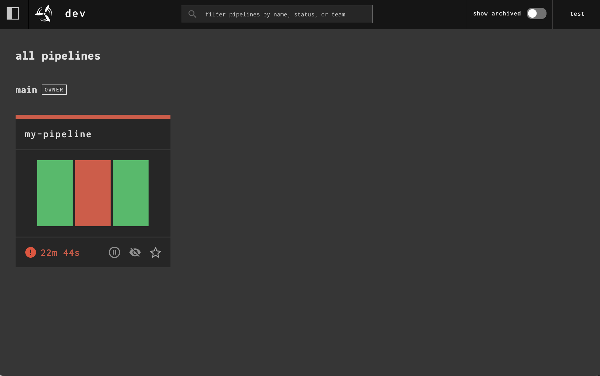
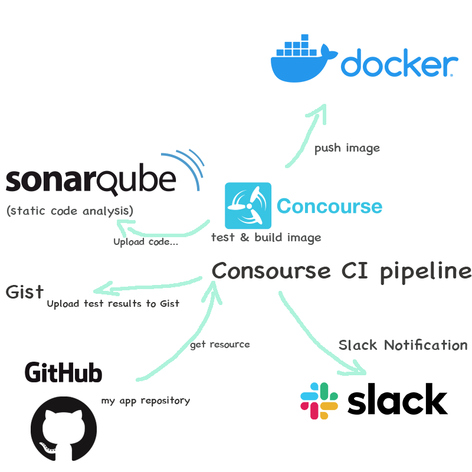
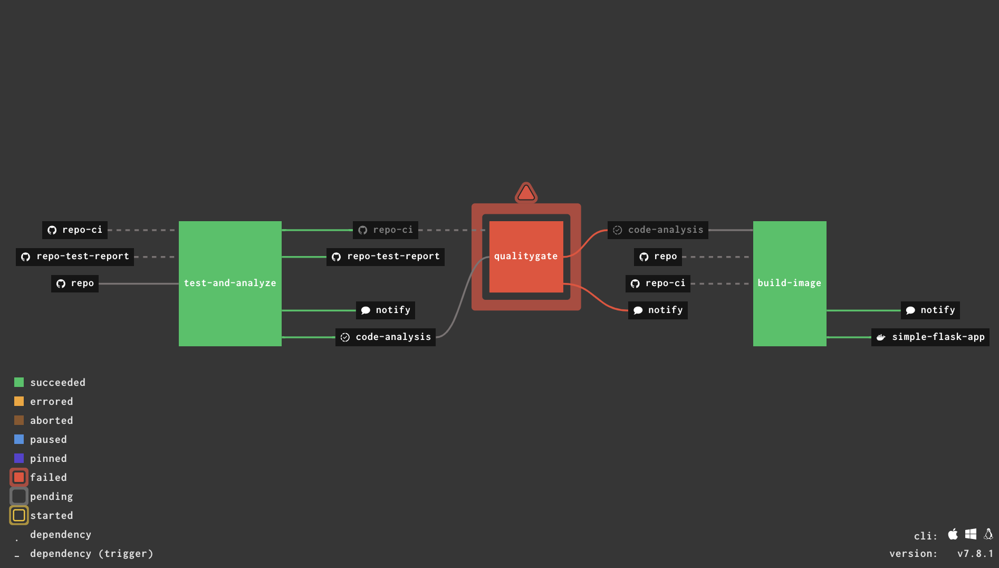
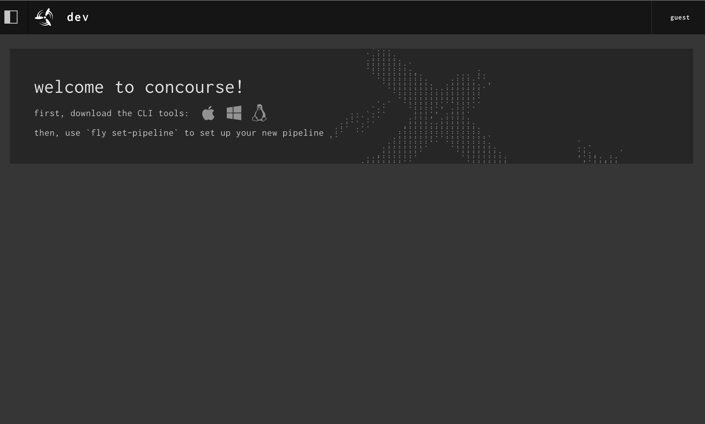
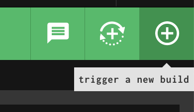
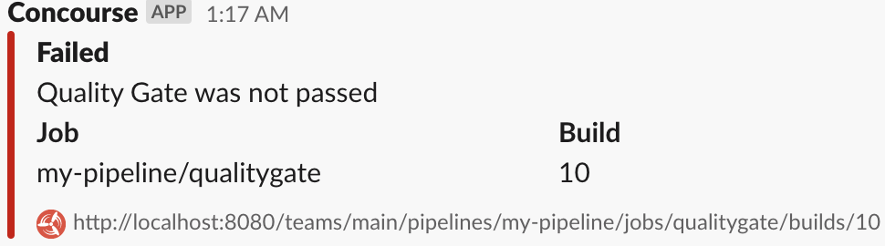

# Concourse CI Sample
This repository is an example of building a CI pipeline using Concourse CI for Concourse CI beginners.
Build and test (pytest), upload test result and coverage to Gist and Sonarqube, Notify Slack, push image to Docker Hub.
# Concourse CI features
* Container based ci
* Pipeline with YAML
* Scalable
* Simple UI



# Pipeline visual image



# Setup

```shell
~$ git clone git@github.com:kodacme/concourse-ci-sample.git
```

```shell
~$ ./keys/generate

~$ docker-compose up -d
```

Install the fly CLI by downloading from [concourse ci](https://concourse-ci.org/).
fly is a CLI dedicated to Concourse CI.  
Concourse CI is operated using this fly command.

```shell
~$ chmod +x ~/Downloads/fly
~$ mv ~/Downloads/fly /usr/local/bin
~$ fly -v
7.8.1
```

Login to 'localhost:8080' with target 'sample-ci'. (username: test, password: test)
```shell
~$ fly -t sample-ci login -c http://localhost:8080
```


## Github token
1. Sign in to Github
2. Settings > Developer settings > Personal access tokens  
   Generate new token
3. Copy token
4. Rewrite github node in dev-pipeline-vars.yaml
   ```yaml
   github:
     username: your username
     password: copy token
   ```

## Sonarqube
Sonarcloud would have been fine, but I build sonarqube sever for a better understanding of Sonarqube.
0. I used sonarqube docker image. 
   [sonarqube docker](https://hub.docker.com/_/sonarqube)
1. ```shell
   $ docker run -itd --name sonarqube -p 9000:9000 sonarqube:lts
   ```
2. Sign in to sonarqube
   `http://your.server.host(e.g.localhost):9000`
3. Create new project  
   If the project key is named "concourse-ci-sample", the pipeline yaml can be used without modification.
4. Generate and copy token
5. Rewrite sonarqube node in dev-pipeline-vars.yaml
   ```yaml
   sonarqube:
     host-url: sonarqube server host
     auth-token: copy token
   ```
6. Change quality gate settings as appropriate.
## Docker Hub
1. Rewrite registry node in dev-pipeline-vars.yaml
   ```yaml
   registry:
     username: your username
     password: your password
   ```
## Slack
1. Use your workspace and enable webhook  
   refer to https://api.slack.com/messaging/webhooks#posting_with_webhooks
2. Copy webhook url
3. Rewrite slack-webhook in dev-pipeline-vars.yaml
   ```yaml
   slack-webhook: webhook url
   ```

## Set pipeline
```shell
~$ fly -t sample-ci set-pipeline -p my-pipeline -c dev-ci/dev-pipeline.yaml -l dev-ci/dev-pipeline-vars.yaml
```

Unpause the new pipeline, which is pause by default
```shell
~$ fly -t sample-ci unpause-pipeline -p my-pipeline
```
You can run the job by creating PR to `develop` branch in my [flask-python-demo repo](https://github.com/kodacme/flask-pytest-demo)
or by clicking the '+' button on the WEB UI.  



#### Slack notification example

